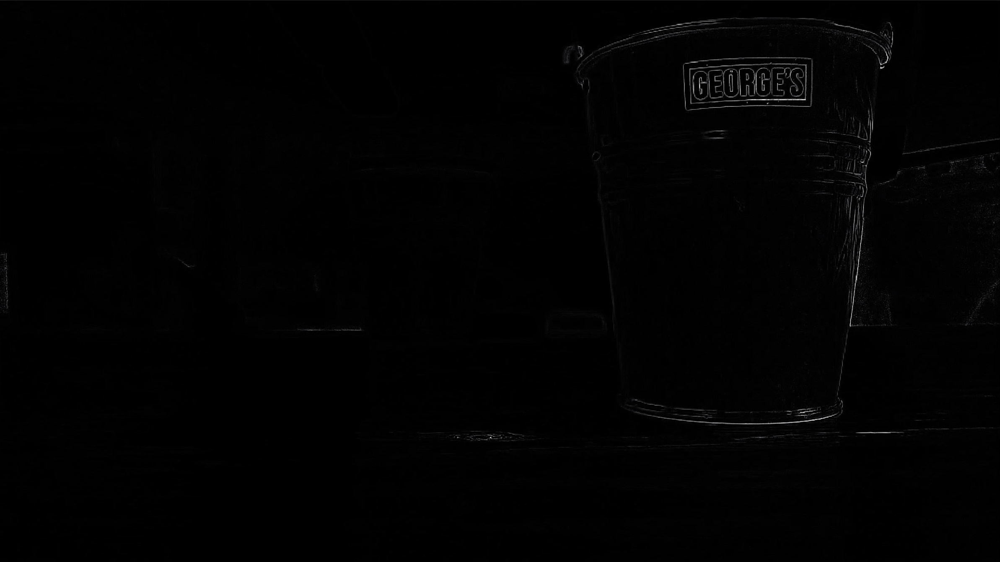

# Monocular_Depth_Measurement
## Description

This is a project that calculates the depth of the photo using a monocular camera.

One day, I was fascinated to Kinect, which is a camera that calculates how far the obejects are from the camera. In the same time, I noticed that normal camera (monocular camera) can calculate the depth by changing the focus. Within two hour, I took the depth image using MATLAB.

## Outcome
### RawData

### DepthData
